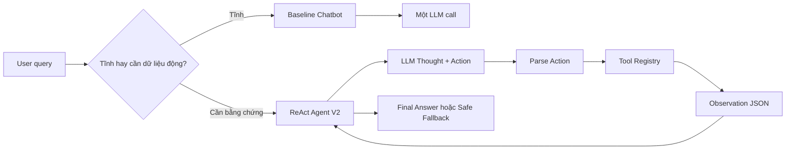

# Báo cáo nhóm: Lab 3 - Chatbot vs ReAct Agent

- **Tên nhóm**: NguyenChiHieu Demo Team
- **Thành viên**: Nguyen Chi Hieu - 2A202601931
- **Ngày hoàn thiện**: 2026-07-28

## 1. Tóm tắt

Bài làm so sánh `Baseline Chatbot` một lần gọi LLM với `ReAct Agent V2` trên cùng 5 test cases e-commerce.

- **Tỉ lệ thành công của Baseline Chatbot**: 40% trên 5 cases.
- **Tỉ lệ thành công của ReAct Agent V2**: 100% trên 5 cases deterministic.
- **Kết luận chính**: Chatbot phù hợp với câu hỏi tĩnh như chính sách đổi trả hoặc giờ làm việc. Với câu hỏi checkout, chatbot không nên tự bịa tổng tiền vì thiếu bằng chứng về tồn kho, giá, coupon, shipping và tổng tiền.

Artifacts:

- `artifacts/evaluation/raw_results.json`
- `artifacts/evaluation/summary.json`
- `artifacts/traces/success_trace_case_3.json`
- `artifacts/traces/failure_trace_v1_repeated_action.json`
- `artifacts/traces/recovery_trace_v2_repeated_action.json`
- `artifacts/traces/rca_repeated_action.md`
- `artifacts/live/ollama_smoke.json`
- `artifacts/live/ollama_agent_smoke.json`

## 2. Kiến trúc hệ thống và Tool

### 2.1 ReAct loop

Flowchart: `docs/hybrid_flowchart.mmd`



### 2.2 Danh sách Tool

| Tool Name | Input Format | Mục đích |
| :--- | :--- | :--- |
| `check_stock` | `{"item_name": "iPhone"}` | Tra cứu giá, tồn kho, khối lượng và trạng thái sản phẩm. |
| `get_discount` | `{"coupon_code": "WINNER"}` | Kiểm tra coupon còn hợp lệ hay không và phần trăm giảm giá. |
| `calc_shipping` | `{"weight": 0.8, "destination": "Hanoi"}` | Tính phí shipping và số ngày giao hàng. |

### 2.3 LLM Provider

- **Evaluation deterministic**: `ScriptedLLM`
- **Live local smoke test**: Ollama `qwen2.5:3b` qua `src/core/ollama_provider.py`
- **Provider mở rộng**: OpenAI, Gemini và local GGUF được giữ trong `src/core/`

## 3. Telemetry và kết quả đánh giá

Lệnh sinh kết quả:

```bash
python scripts/run_lab_evaluation.py
```

Tóm tắt từ `artifacts/evaluation/summary.json`:

| System | Tỉ lệ thành công | Tỉ lệ Safe Fallback | Steps trung bình | Tool calls trung bình |
| :--- | ---: | ---: | ---: | ---: |
| Baseline Chatbot | 0.40 | 0.60 | 1.00 | 0.00 |
| ReAct Agent V2 | 1.00 | 0.00 | 2.40 | 1.40 |

## 4. Phân tích lỗi V1 và sửa ở V2

### Case study: Repeated Action

- **Input**: `I want to buy 2 iPhones using code WINNER and ship to Hanoi. Total?`
- **Expected path**: `check_stock -> get_discount -> calc_shipping`
- **Actual V1 path**: `check_stock -> check_stock -> check_stock`
- **First divergence**: Bước 2 lặp lại `check_stock` thay vì chuyển sang kiểm tra coupon.
- **Root cause**: V1 có `max_steps` nhưng chưa có repeated-action detector.
- **Smallest V2 fix**: Dừng an toàn khi cùng một `Tool` và arguments bị lặp lại mà không tạo thêm bằng chứng mới.
- **Regression command**: `python -m pytest tests/test_agent_recovery.py -q`

### Live local Ollama finding

Đã chạy Ollama local `qwen2.5:3b` bằng hai script:

```bash
python scripts/run_ollama_smoke.py
python scripts/run_ollama_agent_smoke.py
```

Baseline chạy đúng: một LLM call, không gọi Tool, trả lời dạng `safe fallback`. Agent V2 có evidence gate nên không chấp nhận `Final Answer` khi thiếu bằng chứng. Tuy nhiên model live vẫn tạo format chưa chuẩn và bỏ sót `get_discount`, nên agent dừng an toàn ở `max_steps_exceeded`. Kết quả này được lưu trong `artifacts/live/ollama_agent_smoke.json`.

## 5. So sánh Chatbot và Agent

| Case | Kết quả Chatbot | Kết quả Agent | Nhận xét |
| :--- | :--- | :--- | :--- |
| Chính sách đổi trả | Trả lời trực tiếp | Trả lời trực tiếp | Chatbot đủ tốt và rẻ hơn |
| Giờ làm việc | Trả lời trực tiếp | Trả lời trực tiếp | Chatbot đủ tốt và rẻ hơn |
| 2 iPhones + WINNER + Hanoi | Safe fallback | Tổng tiền có bằng chứng từ 3 Tool | Agent tốt hơn |
| MacBook + Saigon | Safe fallback | Dừng sau khi thấy hết hàng | Agent an toàn hơn |
| iPad + LEGACY + Saigon | Safe fallback | Tính tổng không giảm giá vì coupon hết hạn | Agent tốt hơn |

## 6. Mức sẵn sàng production

- **Bảo mật**: `.env`, logs, model files và API keys đã được ignore.
- **Guardrails**: Agent có `max_steps`; V2 có repeated-action detection và evidence gate.
- **Observability**: Agent trả về trace và ghi structured logs.
- **UI artifact**: `web/index.html` hiển thị metrics, Tool path và trace timeline.
- **Cải tiến tiếp theo**: thêm schema validation bằng Pydantic, dùng database/API thật, và thêm human confirmation trước hành động thanh toán.
