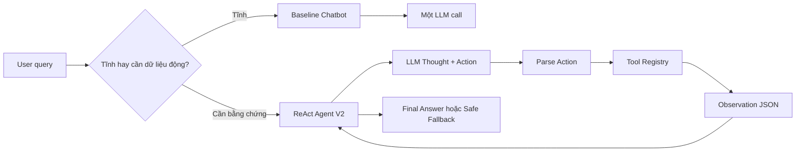

# Báo cáo nhóm: Lab 3 - Chatbot vs ReAct Agent

- **Tên nhóm**: NguyenChiHieu Team
- **Thành viên**: Nguyễn Chí Hiếu - 2A202601931
- **Ngày hoàn thiện**: 2026-07-28

## 1. Tóm tắt

Bài làm so sánh `Baseline Chatbot` một lần gọi LLM với `ReAct Agent V2` trên cùng 5 test cases e-commerce.

- **Tỉ lệ thành công của Baseline Chatbot**: 40% trên 5 cases.
- **Tỉ lệ thành công của ReAct Agent V2**: 100% trên 5 cases deterministic.
- **Kết luận chính**: Chatbot phù hợp với câu hỏi tĩnh như chính sách đổi trả hoặc giờ làm việc. Với câu hỏi checkout, chatbot không nên tự bịa tổng tiền vì thiếu bằng chứng về tồn kho, giá, coupon, shipping và tổng tiền.

Artifacts:

- `artifacts/evaluation/raw_results.json`
- `artifacts/evaluation/raw_result_table.csv`
- `artifacts/evaluation/summary.json`
- `artifacts/traces/success_trace_case_3.json`
- `artifacts/traces/failure_trace_v1_repeated_action.json`
- `artifacts/traces/recovery_trace_v2_repeated_action.json`
- `artifacts/traces/rca_repeated_action.md`
- `artifacts/live/ollama_smoke.json`
- `artifacts/live/ollama_agent_smoke.json`
- `artifacts/live/live_system_demo.json`
- `artifacts/monitoring/live_monitoring_summary.json`
- `artifacts/experiments/ablation_guardrail.json`

## 2. Kiến trúc hệ thống và Tool

### 2.1 ReAct loop

Flowchart: `docs/hybrid_flowchart.mmd`



### 2.2 Danh sách Tool

| Tool Name | Input Format | Mục đích |
| :--- | :--- | :--- |
| `check_stock` | `{"item_name": "iPhone"}` | Tra cứu giá, tồn kho, khối lượng và trạng thái sản phẩm. |
| `get_discount` | `{"coupon_code": "WINNER"}` | Kiểm tra coupon còn hợp lệ hay không và phần trăm giảm giá. |
| `calc_shipping` | `{"weight": 0.8, "destination": "Hanoi"}` | Tính phí shipping và số ngày giao hàng. |
| `calc_total` | `{"item_quantity": 2, "price_per_item": 25000000, "discount_percent": 10, "shipping_cost": 38000}` | Tính checkout total có công thức rõ ràng sau khi đã có Observation bắt buộc. |
| `search_policy` | `{"query": "return policy"}` | Search policy nội bộ cho các câu hỏi chính sách tĩnh. |

### 2.3 LLM Provider

- **Evaluation deterministic**: `ScriptedLLM`
- **Live API demo**: Groq API qua `src/core/groq_provider.py`, cấu hình bằng `.env`
- **Local fallback**: Ollama `qwen3.5:4b` qua `src/core/ollama_provider.py`
- **Provider mở rộng**: OpenAI, Gemini và local GGUF được giữ trong `src/core/`

## 3. Telemetry và kết quả đánh giá

Lệnh sinh kết quả:

```bash
python scripts/run_lab_evaluation.py
```

Tóm tắt từ `artifacts/evaluation/summary.json`:

| System | Success rate | Safe fallback | Parser error | Hallucinated tool | Recovery | Steps TB | Tool calls TB | Median/max latency | Avg tokens |
| :--- | ---: | ---: | ---: | ---: | ---: | ---: | ---: | :--- | ---: |
| Baseline Chatbot | 0.40 | 0.60 | 0.00 | 0.00 | 1.00 | 1.00 | 0.00 | 1/1 ms | 40.00 |
| ReAct Agent V2 | 1.00 | 0.00 | 0.00 | 0.00 | 1.00 | 2.80 | 1.80 | 1/1 ms | 40.00 |

`artifacts/evaluation/raw_result_table.csv` lưu bảng raw theo đúng các cột: Case, System, Factual, Grounding, Tool selection, Safety, Completeness, Termination, Tool path, Steps/errors và Tokens/latency.

Lưu ý: metrics deterministic dùng `ScriptedLLM`, nên latency/tokens chỉ là giá trị tái lập để kiểm tra orchestration. Metrics live API được ghi riêng trong `artifacts/monitoring/live_monitoring_summary.json`; không trộn với bảng deterministic.

## 4. Phân tích lỗi V1 và sửa ở V2

### Case study: Repeated Action

- **Input**: `I want to buy 2 iPhones using code WINNER and ship to Hanoi. Total?`
- **Expected path**: `check_stock -> get_discount -> calc_shipping -> calc_total`
- **Actual V1 path**: `check_stock -> check_stock -> check_stock`
- **First divergence**: Bước 2 lặp lại `check_stock` thay vì chuyển sang kiểm tra coupon.
- **Root cause**: V1 có `max_steps` nhưng chưa có repeated-action detector.
- **Smallest V2 fix**: Dừng an toàn khi cùng một `Tool` và arguments bị lặp lại mà không tạo thêm bằng chứng mới.
- **Regression command**: `python -m pytest tests/test_agent_recovery.py -q`

### Live API finding

Đã chạy live demo bằng Groq API qua script:

```bash
python scripts/run_live_demo.py
```

Baseline chạy đúng: một LLM call, không gọi Tool, trả lời dạng `safe fallback`. Agent V2 có evidence gate và `calc_total` prerequisite guardrail nên không chấp nhận tổng tiền khi thiếu Observation từ `check_stock`, `get_discount` và `calc_shipping`. Với live system demo, Groq API đã đi qua luồng Tool, sau đó trả final answer đúng: `45,038,000 VND`. Kết quả được lưu trong `artifacts/live/live_system_demo.json`.

## 5. Bằng chứng kỹ thuật bổ sung

| Hạng mục | Bằng chứng |
| :--- | :--- |
| Live system demo | `python scripts/run_live_demo.py`, artifact `artifacts/live/live_system_demo.json`, trạng thái `demo_passed=true`. |
| Monitoring | `artifacts/monitoring/live_monitoring_summary.json` ghi tokens, latency, token ratio và cost estimate demo. |
| Tool mở rộng | `calc_total` và `search_policy` trong `src/tools/tools.py`, có unit tests trong `tests/test_tools.py`. |
| Failure Handling | repeated-action detector, evidence gate, `calc_total` prerequisite guardrail, có tests trong `tests/test_agent_recovery.py`. |
| Ablation Experiment | `artifacts/experiments/ablation_guardrail.json` so sánh V1 lặp Tool với V2 dừng an toàn. |

## 6. So sánh Chatbot và Agent

| Case | Kết quả Chatbot | Kết quả Agent | Nhận xét |
| :--- | :--- | :--- | :--- |
| Chính sách đổi trả | Trả lời trực tiếp | Trả lời trực tiếp | Chatbot đủ tốt và rẻ hơn |
| Giờ làm việc | Trả lời trực tiếp | Trả lời trực tiếp | Chatbot đủ tốt và rẻ hơn |
| 2 iPhones + WINNER + Hanoi | Safe fallback | Tổng tiền có bằng chứng từ Tool path `check_stock -> get_discount -> calc_shipping -> calc_total` | Agent tốt hơn |
| MacBook + Saigon | Safe fallback | Dừng sau khi thấy hết hàng | Agent an toàn hơn |
| iPad + LEGACY + Saigon | Safe fallback | Tính tổng không giảm giá vì coupon hết hạn | Agent tốt hơn |

## 7. Exit ticket 

1. **Chatbot fail hoặc fallback ở case nào, vì sao?**

   Chatbot fallback ở case 3, 4 và 5 vì các câu này cần dữ liệu động: giá, tồn kho, coupon, shipping và tổng tiền. Baseline đúng protocol nên không gọi Tool và không tự bịa số liệu.

2. **Agent đi qua Tool path nào?**

   - Case 1 và 2: không gọi Tool vì là câu hỏi tĩnh.
   - Case 3: `check_stock -> get_discount -> calc_shipping -> calc_total`.
   - Case 4: `check_stock`, sau đó dừng vì `MacBook` hết hàng.
   - Case 5: `check_stock -> get_discount -> calc_shipping -> calc_total`.

3. **Failed trace lệch đầu tiên ở bước nào?**

   Failed trace V1 lệch ở bước 2: thay vì chuyển từ `check_stock` sang kiểm tra coupon, Agent V1 lặp lại `check_stock({"item_name": "iPhone"})`.

4. **V2 thay đổi gì dựa trên trace đó?**

   V2 thêm repeated-action detector để dừng khi cùng một Tool và arguments bị lặp mà không có bằng chứng mới. Sau live test, V2 có thêm evidence gate và prerequisite guardrail cho `calc_total`.

5. **Metric nào tốt lên và trade-off nào xấu đi?**

   Metric tốt lên là Agent V2 đạt 100% success rate trên 5 case deterministic, tool selection đúng hơn, grounding rõ hơn và không có parser/hallucinated-tool error. Trade-off là Agent dùng nhiều bước hơn chatbot: trung bình 2.80 steps và 1.80 Tool calls so với chatbot 1 step và 0 Tool calls.

6. **Command nào tái tạo claim trong report?**

   - `python scripts/run_lab_evaluation.py` tái tạo summary, raw results, raw result table và traces.
   - `python scripts/run_live_demo.py` tái tạo live demo qua Groq API.
   - `python scripts/generate_evidence_artifacts.py` tái tạo monitoring và ablation artifacts.
   - `python -m pytest -q` chạy regression tests.

