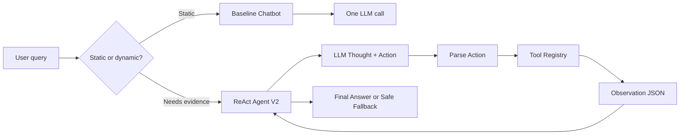

# Group Report: Lab 3 - Production-Grade Agentic System

- **Team Name**: NguyenChiHieu Demo Team
- **Team Members**: Nguyen Chi Hieu - 2A202601931
- **Deployment Date**: 2026-07-28

## 1. Executive Summary

The system compares a one-call e-commerce chatbot baseline with a ReAct Agent V2 on the same 5 deterministic cases from the lab guide.

- **Baseline success rate**: 40% on 5 cases.
- **Agent V2 success rate**: 100% on 5 cases.
- **Key outcome**: The chatbot is sufficient for static policy and working-hours questions, but it must safe-fallback for checkout totals because it has no evidence for stock, coupon validity, shipping, or final price.

Artifacts:

- `artifacts/evaluation/raw_results.json`
- `artifacts/evaluation/summary.json`
- `artifacts/traces/success_trace_case_3.json`
- `artifacts/traces/failure_trace_v1_repeated_action.json`
- `artifacts/traces/recovery_trace_v2_repeated_action.json`
- `artifacts/traces/rca_repeated_action.md`
- `artifacts/live/ollama_smoke.json`
- `artifacts/live/ollama_agent_smoke.json`

## 2. System Architecture & Tooling

### 2.1 ReAct Loop Implementation

Flowchart: `docs/hybrid_flowchart.mmd`



### 2.2 Tool Definitions

| Tool Name | Input Format | Use Case |
| :--- | :--- | :--- |
| `check_stock` | `{"item_name": "iPhone"}` | Read deterministic catalog price, stock, weight, and status. |
| `get_discount` | `{"coupon_code": "WINNER"}` | Validate coupon status and discount percent. |
| `calc_shipping` | `{"weight": 0.8, "destination": "Hanoi"}` | Calculate deterministic shipping fee and delivery days. |

### 2.3 LLM Providers Used

- **Deterministic evaluation**: `ScriptedLLM`
- **Live local smoke test**: Ollama `qwen2.5:3b` through `src/core/ollama_provider.py`.
- **Other live-provider extension points**: OpenAI, Gemini, and local GGUF provider are kept in `src/core/`.

## 3. Telemetry & Performance Dashboard

The evaluation script writes raw rows and summary metrics:

```bash
python scripts/run_lab_evaluation.py
```

Summary from `artifacts/evaluation/summary.json`:

| System | Success Rate | Safe Fallback Rate | Avg Steps | Avg Tool Calls |
| :--- | ---: | ---: | ---: | ---: |
| Baseline Chatbot | 0.40 | 0.60 | 1.00 | 0.00 |
| ReAct Agent V2 | 1.00 | 0.00 | 2.40 | 1.40 |

## 4. Root Cause Analysis - Failure Trace

### Case Study: Repeated Action

- **Input**: `I want to buy 2 iPhones using code WINNER and ship to Hanoi. Total?`
- **Expected path**: `check_stock -> get_discount -> calc_shipping`
- **Actual V1 path**: `check_stock -> check_stock -> check_stock`
- **First divergence**: Step 2 repeated `check_stock` instead of moving to coupon validation.
- **Root cause**: V1 had `max_steps` but no repeated-action detector.
- **Smallest V2 fix**: Stop safely when the exact same tool and arguments repeat without new evidence.
- **Regression command**: `python -m pytest tests/test_agent_recovery.py -q`

### Live Local Ollama Finding

The local Ollama model `qwen2.5:3b` was run through the baseline and Agent V2 smoke scripts:

```bash
python scripts/run_ollama_smoke.py
python scripts/run_ollama_agent_smoke.py
```

Baseline behaved correctly as a safe fallback: one LLM call, zero tools, and no grounded total. Agent V2 improved over a premature answer by enforcing an evidence gate, but the live model still produced imperfect tool format and missed the real `get_discount` call, so the agent stopped safely at `max_steps_exceeded`. This is recorded in `artifacts/live/ollama_agent_smoke.json` and shows why deterministic tests and live traces should be reported separately.

## 5. Ablation Studies & Experiments

### Chatbot vs Agent on Shared Cases

| Case | Chatbot Result | Agent Result | Winner |
| :--- | :--- | :--- | :--- |
| Return policy | Direct answer | Direct answer | Chatbot for cost/simplicity |
| Working hours | Direct answer | Direct answer | Chatbot for cost/simplicity |
| 2 iPhones + WINNER + Hanoi | Safe fallback | Grounded total with 3 tools | Agent |
| MacBook + Saigon | Safe fallback | Stops after out-of-stock evidence | Agent |
| iPad + LEGACY + Saigon | Safe fallback | Total without discount after coupon error | Agent |

## 6. Production Readiness Review

- **Security**: `.env`, logs, model files, and API keys are ignored.
- **Guardrails**: Agent has `max_steps`; V2 adds repeated-action detection and an evidence gate for checkout totals.
- **Observability**: Agent returns trace steps and writes structured log events.
- **UI artifact**: `web/index.html` displays evaluation metrics, tool path, and trace timeline.
- **Next step**: Replace deterministic tools with authenticated APIs or database lookups, then add schema validation and human escalation for checkout actions.
